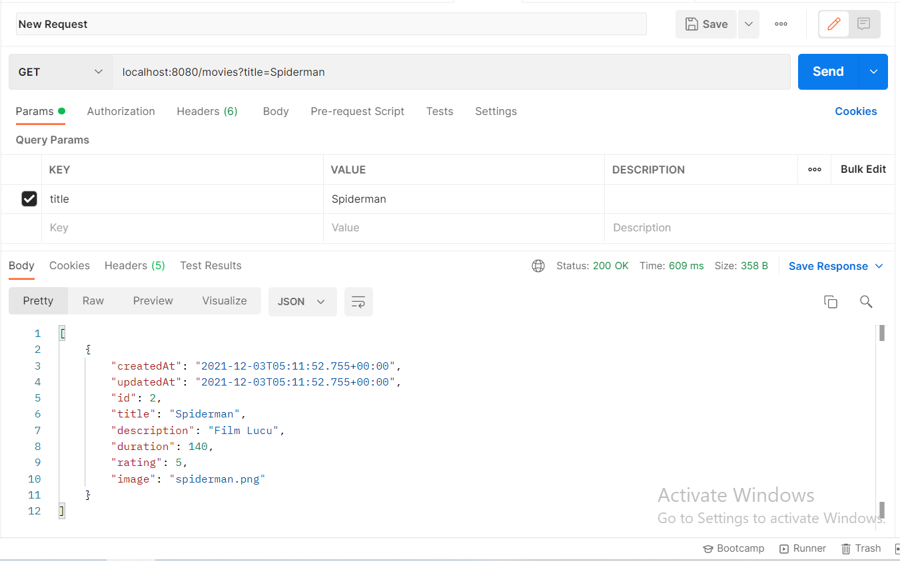

# MovieApp---SpringBoot
How to build the movie app using springboot

## Requirements

1. Java 11
2. Maven 3.8.4 atau lebih
3. Postgre 13.3 atau lebih

## Langkah-langkah Melalukan Setup

**1. Melakukan Git Clone**
```bash
https://github.com/RachelGultom2000/MovieApp---SpringBoot.git
```

**2. Setting Database**
Sesuaikan nama database,username dan password yang ada pada lokal/komputer anda di file application.properties.

**3. Build dan Run Menggunakan Maven** <br>
Supaya lebih mudah,cukup jalankan seperti ini pada terminal
```bash
mvn spring-boot:run
```
**Cara membuka terminal**
1. Klik kanan pada root folder
2. Lalu pilih Show Local in Terminal
3. Kemudian pilih terminal dan jalankan perintah diatas

**Aplikasi secara default akan berjalan di Port 8080 dengan url http://localhost:8080/**

## Penjelasan tentang API ##
1. GET : http://localhost:8080/movies => menampilkan daftar keseluruhan movie.


2. GET : http://localhost:8080/movies?title=Spiderman => menampilkan daftar pencarian movie berdasarkan title.


3. GET : http://localhost:8080/movies/1 => menampilkan detail movie berdasarkan id;


4. GET : http://localhost:8080/movies/1/categories => menampilkan kategori dengan id movie dari tabel movie (relasi one-to-many)

